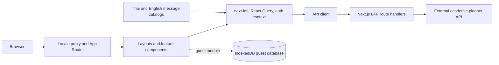

# Project Overview

Academic Planner is a bilingual Thai/English Next.js 16 web application for viewing grades,
GPA trends, semesters, goals, schedules, deadlines, and degree progress in one workspace. It
combines locale-aware App Router pages, a browser-side query and authentication layer, a
same-origin backend-for-frontend (BFF), and an IndexedDB module for limited guest data.

## Repository Structure

- `.git/` stores Git metadata and must not be edited directly.
- `.next/` contains generated Next.js development and build output.
- `messages/` contains the `th` and `en` `next-intl` message catalogs.
- `node_modules/` contains installed npm dependencies and the version-matched Next.js guides.
- `public/` contains static SVGs and PWA icon assets served from the site root.
- `src/` contains all application source code.
  - `app/` defines App Router layouts, localized pages, the manifest, and BFF route handlers.
  - `components/` contains the application shell, providers, and feature views.
  - `i18n/` defines supported locales, locale routing, and message loading.
  - `lib/` contains API, guest database, shared type, and server-only backend helpers.
  - `proxy.ts` applies locale middleware outside API, Next.js, and static-asset paths.
- `.gitignore` excludes dependencies, builds, coverage, environment files, and local tooling data.
- `DESIGN.md` documents the design system; `README.md` contains starter and deployment guidance.
- `package.json` and `package-lock.json` define npm scripts and locked dependencies.
- `next.config.ts`, `tsconfig.json`, `eslint.config.mjs`, and `postcss.config.mjs` configure
  tooling.
- `next-env.d.ts` is generated by Next.js and must not be edited manually.

## Build & Development Commands

Use npm because `package-lock.json` is committed. Install exactly the locked dependency graph:

```bash
npm ci
```

Start the development server at `http://localhost:3000`:

```bash
npm run dev
```

Create and serve a production build:

```bash
npm run build
npm run start
```

Run the configured test commands:

```bash
npm test
npm run test:watch
npm run test:e2e
```

Run linting and TypeScript checks:

```bash
npm run lint
npm run typecheck
```

> TODO: Add and document a repository-supported debugger configuration and command.

`README.md` identifies Vercel as the intended easy deployment path, but the repository has no
deployment configuration or deploy script.

```bash
npm run build
```

> TODO: Define the deployment environment and add the exact deploy command after it is configured.

## Code Style & Conventions

- Write strict TypeScript and use the `@/*` alias for imports rooted at `src/`.
- Use PascalCase for React components and exported data types, camelCase for functions and values,
  and kebab-case for multiword source file names.
- Follow App Router naming for framework files such as `page.tsx`, `layout.tsx`, and `route.ts`.
- Keep client-only modules explicit with `"use client"`; keep backend helpers guarded by
  `import "server-only"`.
- Keep user-facing text in `messages/en.json` and `messages/th.json` where practical, and update
  both catalogs together.
- Use the tokens and interaction guidance in `DESIGN.md` and the utilities in `globals.css`.
- ESLint uses the flat config with Next.js Core Web Vitals and TypeScript rules; warnings fail the
  lint command.
- No formatter configuration is checked in; preserve the surrounding style and keep diffs focused.

Recent history includes a Conventional Commit. Use this template unless maintainers specify a
different policy:

```text
<type>(<scope>): <imperative summary>
```

Example: `feat(foundation): scaffold bilingual academic dashboard`

> TODO: Document allowed commit types, scopes, body requirements, and breaking-change syntax.

## Architecture Notes



`src/proxy.ts` selects locale-aware routes, and localized layouts load messages and install the
internationalization, query, and authentication providers. Feature components request cloud data
through `apiFetch`; the browser never calls the upstream service directly. The BFF allows only
known domains and safe path segments, forwards bearer access tokens, and rejects cross-origin
mutations. Authentication routes keep the refresh token in an HTTP-only cookie while the access
token remains in browser memory. `guest-db.ts` defines a bounded Dexie/IndexedDB data store, but the
current feature views are not yet wired to it. `BACKEND_API_URL` selects the upstream API.

## Testing Strategy

- Unit and component tooling is installed through Vitest, jsdom, and Testing Library.
- Integration tests should cover providers, API retry/refresh behavior, BFF validation, locale
  loading, and guest database behavior.
- End-to-end tooling is installed through Playwright and should cover both locales, guest and
  authenticated paths, navigation, and critical academic workflows.
- No test files, Vitest setup, Playwright configuration, or coverage threshold are checked in yet;
  the configured test commands may report that no tests were found.

Run the local quality gates with:

```bash
npm run lint
npm run typecheck
npm test
npm run test:e2e
npm run build
```

No CI workflow is present. Once tests exist, CI should install from the lockfile and run the same
non-watch commands:

```bash
npm ci
npm run lint
npm run typecheck
npm test
npm run test:e2e
npm run build
```

> TODO: Add CI, test fixtures, browser installation/caching, and an explicit coverage policy.

## Security & Compliance

- Keep secrets in ignored `.env*` files or the deployment platform's secret store; never commit or
  print secret values.
- `BACKEND_API_URL` is server-only. Do not introduce a `NEXT_PUBLIC_` equivalent for private
  backend configuration or credentials.
- Preserve the BFF's domain and path allowlists, same-origin checks for mutations, no-store
  responses, refresh-token redaction, and secure production cookie settings.
- Do not persist access tokens in local storage, IndexedDB, URLs, logs, or client-readable cookies.
- Validate untrusted data at system boundaries before expanding write-capable flows.
- Review lockfile changes and run the available npm dependency audit before merging dependency
  updates.

```bash
npm audit
```

> TODO: Configure automated dependency scanning, secret scanning, and vulnerability remediation.

> TODO: Add a `LICENSE` file and document privacy, retention, and regulatory requirements before
> distributing or storing real student data.

## Agent Guardrails

- Before changing Next.js code, read the relevant version-matched guide under
  `node_modules/next/dist/docs/`; this release has breaking API, convention, and structure changes.
- Never edit `.git/`, `.next/`, `node_modules/`, or `next-env.d.ts` directly.
- Change `package-lock.json` only as part of an intentional dependency change made with npm.
- Never read, create, modify, or expose real `.env*` secrets without explicit user authorization;
  a redacted `.env.example` may be added when requested.
- Preserve unrelated user changes and avoid broad rewrites, generated churn, or destructive Git
  operations.
- Require human review for authentication, cookie, origin validation, BFF allowlist, dependency,
  persistence schema, and deployment changes.
- Keep English and Thai behavior aligned; request review from a fluent speaker for substantive
  translation changes.
- Run lint, type-check, relevant tests, and a production build in proportion to the change, and
  report any gate that could not be run.
- Do not run load tests, repeated authentication attempts, bulk imports, or high-volume upstream
  requests without explicit approval.

> TODO: Define repository owners, mandatory approval counts, protected paths, and numeric API rate
> limits.

## Extensibility Hooks

- `BACKEND_API_URL` overrides the default upstream API base URL on the server.
- Add locales in `src/i18n/routing.ts`, provide a matching `messages/<locale>.json`, and review all
  locale-aware navigation and metadata.
- Add top-level workspace sections through the `Section` type, icon/navigation map, dynamic section
  allowlist, translations, and `FeatureView` dispatch.
- Add BFF domains only through the explicit allowlist in
  `src/app/api/bff/[domain]/[...path]/route.ts` and include security tests.
- Extend guest persistence by versioning the Dexie schema and `GuestSnapshot`; never rewrite an
  existing schema version in place.
- React Query defaults are centralized in `Providers`, and Next.js configuration is wrapped by the
  `next-intl` plugin.

There is no formal plugin API or feature-flag framework.

> TODO: Define feature-flag ownership, naming, defaults, rollout strategy, and retirement process
> before adding flags.

## Further Reading

- [README.md](./README.md) for local startup and upstream Next.js deployment references.
- [DESIGN.md](./DESIGN.md) for visual tokens and interaction conventions.
- [package.json](./package.json) for the authoritative scripts and dependency versions.
- [next.config.ts](./next.config.ts) for current Next.js and `next-intl` integration.
- [Local Next.js documentation](./node_modules/next/dist/docs/index.md) after running `npm ci`.

> TODO: Add `docs/ARCH.md`, architecture decision records, API contracts, deployment runbooks, and
> contributor documentation, then link them here.
